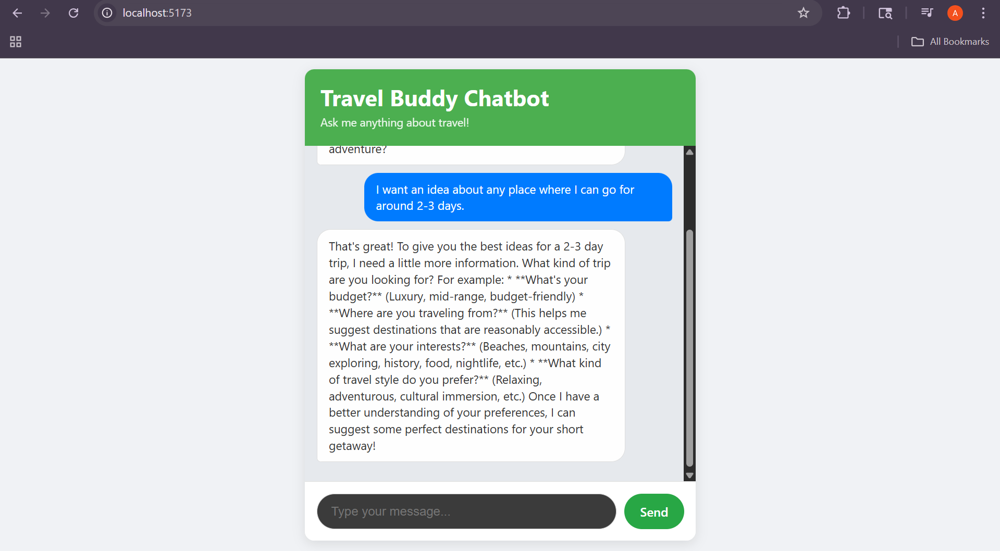

# Travel-Buddy-Chatbot 🌍✈️
Your personal AI-powered chatbot travel planning assistant, powered by React (Frontend), FastAPI (Backend), and Google Gemini.

### ✨ Get Started in 3 Steps! ✨

1.  **Clone the project & install dependencies:**
    ```bash
    git clone <your-repo-url>
    cd travel-buddy-chatbot/backend
    pip install -r requirements.txt # or list packages directly
    cd ../frontend
    npm install
    ```
2.  **Add your Gemini API Key:**
    * Create a `.env` file in the `backend/` directory.
    * Update: `GEMINI_API_KEY="YOUR_API_KEY"`
3.  **Run it!**
    * In one terminal (`backend/`): `uvicorn main:app --reload`
    * In another terminal (`frontend/`): `npm run dev`
    * Open `http://localhost:5173/` in your browser. (Or `http://TravelBuddy:5173/` if you configured your `hosts` file).

---

### 📚 Tech Stack

* **Frontend:** React, TypeScript, Vite, CSS
* **Backend:** FastAPI, Pydantic, Python-Dotenv, Uvicorn
* **AI:** Google Gemini API

### 🚀 Features

* Instant travel advice & itinerary planning.
* Friendly "Travel Buddy" persona.


